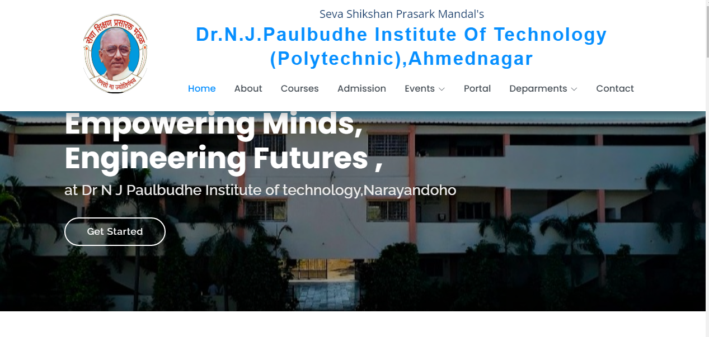

# CampusEase

**CampusEase** is a comprehensive and user-friendly college website created as my final year project during my Diploma in Computer Engineering. This project is designed to serve as an all-in-one solution for college-related information and management. It simplifies navigation and provides essential resources for students, faculty, and visitors.

## Features

- **Home Page**: Provides an overview of the college with quick access to key sections.
- **Student Portal**: A dedicated space for students to access their information, announcements, and other resources.
- **Admission Information**: Details about the admission process, eligibility, and forms.
- **Event Calendar**: Stay updated with college events and schedules.
- **Contact Page**: Quick and easy way to reach out to the college administration.
- **Course Details**: Comprehensive information about the courses offered by the college.

## Technologies Used

- **Frontend**: HTML, CSS, JavaScript, Bootstrap
- **Backend**: PHP
- **Database**: MySQL

## File Structure

- `index.html`: Entry point of the website.
- `about.html`: About the college.
- `studentPortal.html`: Student-specific portal.
- `contact.html`: Contact information.
- `admission.html`: Admission details.
- Additional files for events, courses, grievances, etc.

## How to Run the Project

1. Clone the repository:
   ```bash
   git clone https://github.com/Onkarsathe007/CampusEase.git
   ```
2. Set up a local server (e.g., XAMPP, WAMP).
3. Place the project folder in the server directory (e.g., `htdocs` for XAMPP).
4. Start the server and navigate to `http://localhost/CampusEase` in your browser.

## Purpose

This project was developed as a part of my final year Diploma curriculum to showcase my skills in web development and problem-solving. It highlights the practical application of concepts learned throughout the course.

## Contributions

Contributions are welcome! If you'd like to suggest improvements or add features, feel free to fork the repository and create a pull request.

---

Thank you for visiting this repository. I hope it inspires and assists you in your projects!
